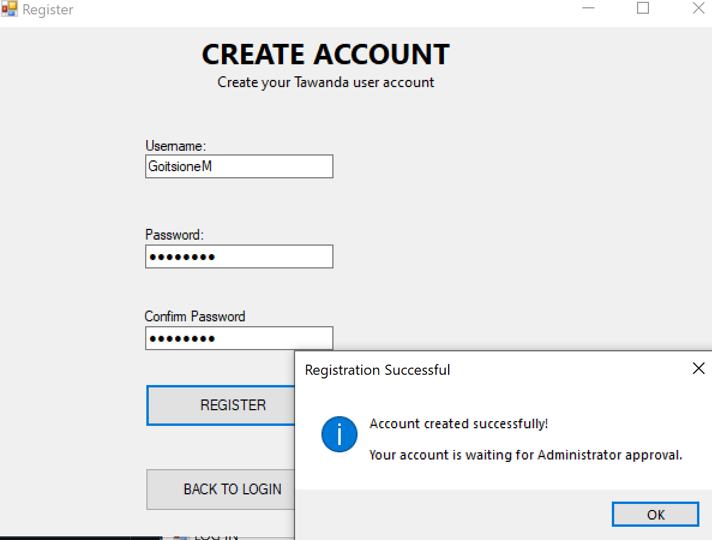
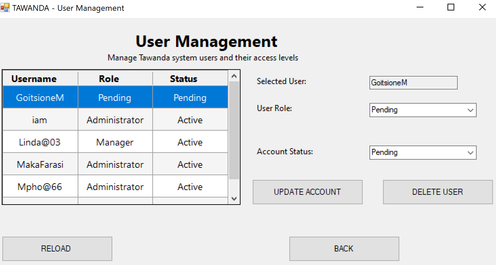
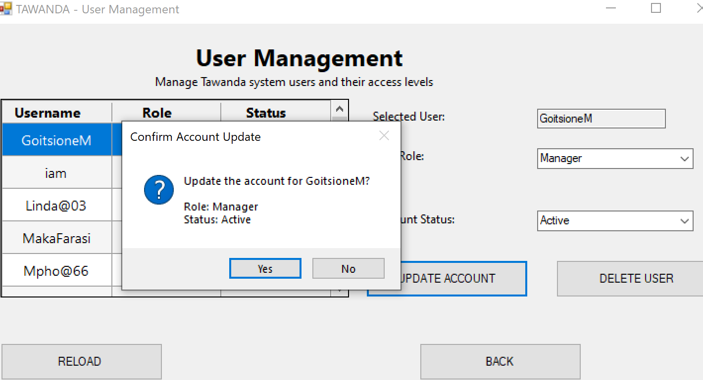
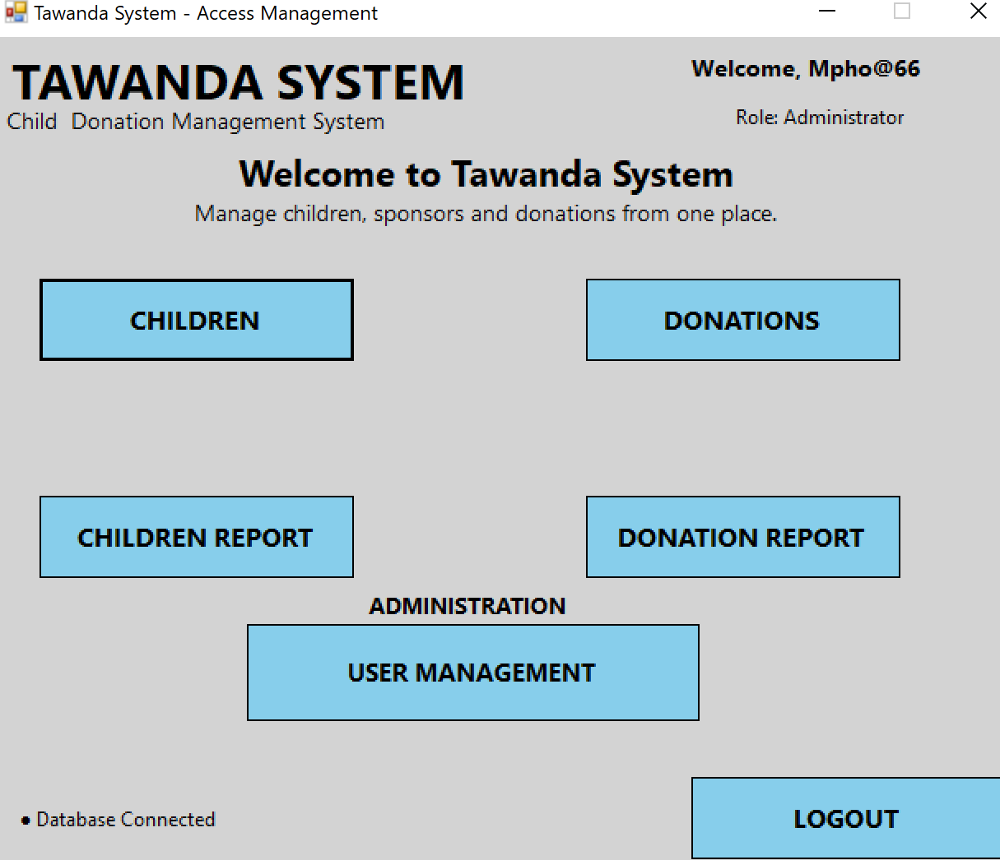
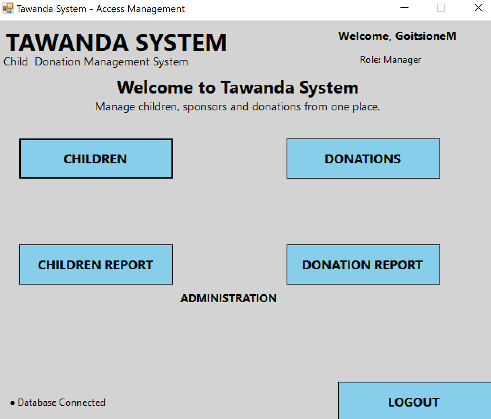
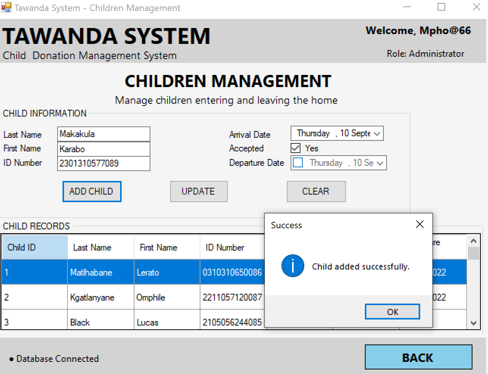
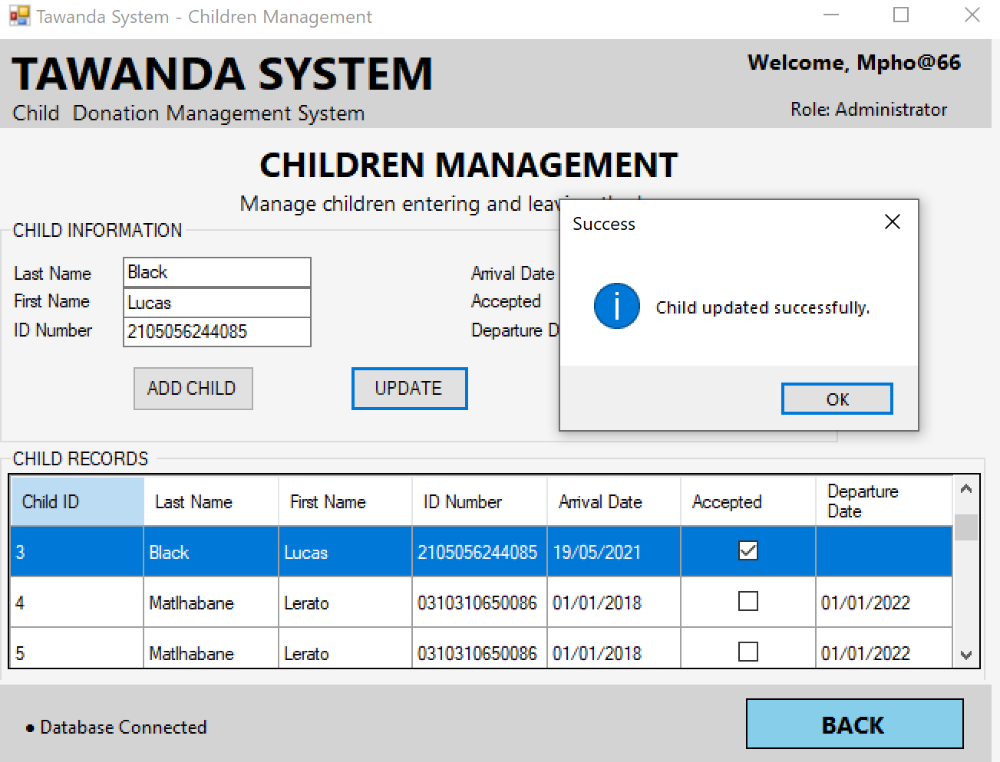
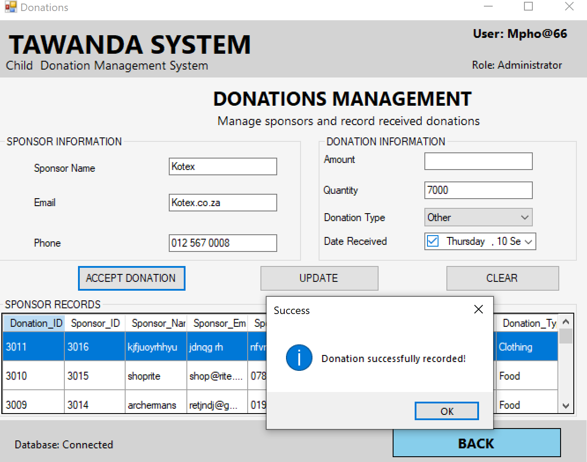
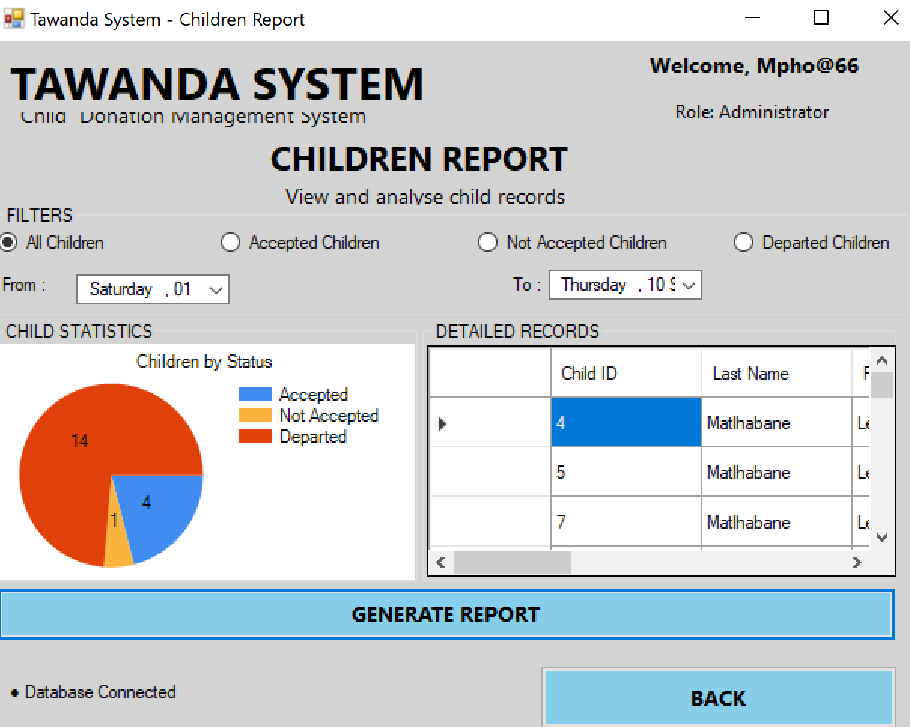
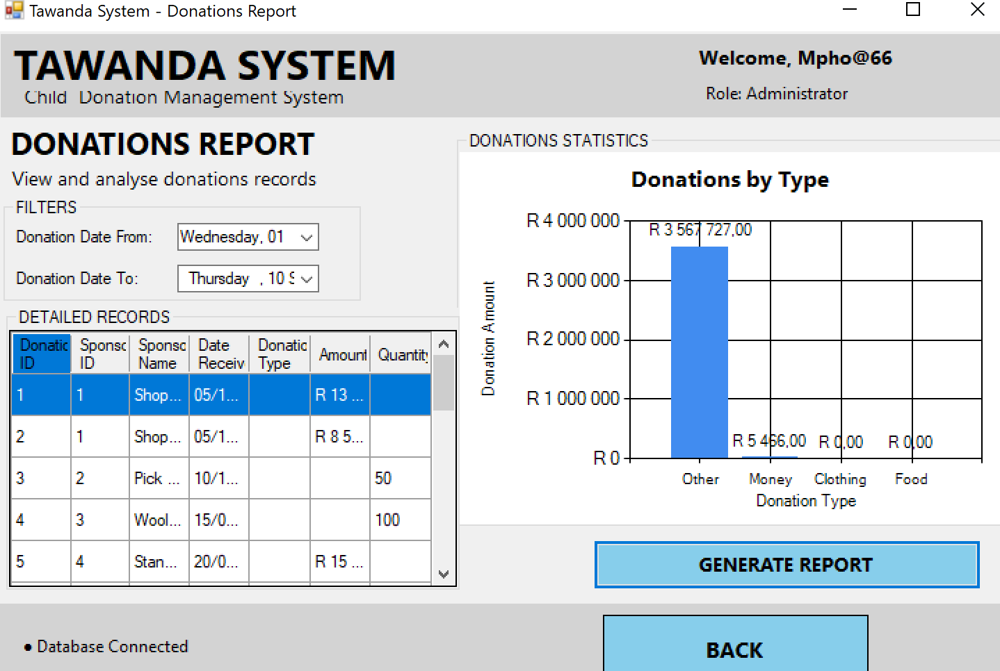

# Tawanda System

The **Tawanda System** is a desktop-based orphanage management system developed using **C# Windows Forms** and **Microsoft SQL Server**.

The system helps manage important orphanage records such as children, sponsors, donations, and users.

## Features

* **Child Management** – Add, update, search, and manage child records.
*  **Sponsor Management** – Store and update sponsor information.
*  **Donation Management** – Record and manage donations received from sponsors.
*  **Reports** – Generate child and donation reports.
*  **User Management** – Manage users and control access to the system.
*  **Database Integration** – Store system information using Microsoft SQL Server.

## Technologies

* C#
* Windows Forms
* .NET
* Microsoft SQL Server
* SQL
* Visual Studio
* Git & GitHub

## Database

The system uses a **TAWANDA** SQL Server database to store:

* Child records
* Sponsor records
* Donation records
* User information

The database script is included in the repository as:

`Tawanda_Database.sql`

## Running the Project

1. Clone the repository.
2. Open `TawandaSystem.sln` in Visual Studio.
3. Set up the **TAWANDA** database using the included SQL script.
4. Check the database connection settings.
5. Build and run the application.

## Project Background

This project was originally developed as a **CMPG223 Group 19** project. The updated version involved improving the existing system, fixing database and application issues, and improving the child, sponsor, donation, user management, and reporting functionality.

## Repository

[Updated Tawanda System](https://github.com/CMPG223-GROUP19/Updated-Sytem)

## 📸 
## System Screenshots

### 1. Login Page

The login page allows registered users to securely access the Tawanda System according to their assigned role.

### 2. Create Account

The administrator can create a new user account. A confirmation message is displayed after the new user has been successfully registered.

### 3. User Management

The administrator can access the User Management page to view and manage registered system users.

### 4. Update User Role and Account Status

The administrator can update a user's details, assign a role such as Manager, and activate the user's account.

### 5. Administrator Access Management

When an Administrator logs in, the Access Management page provides access to all available sections of the Tawanda System, including User Management.

### 6. Manager Access Management

When a Manager logs in, the Access Management page displays only the sections available to the Manager. The User Management section is restricted to Administrators.

### 7. Add Child Record

A new child can be added to the Tawanda System and the child's information is recorded in the system.

### 8. Update Child Record

Selecting a child from the DataGridView automatically populates the relevant fields. The user can then update the child's information, including recording when the child has departed from Tawanda Home.

### 9. Record Donation

The Donations page allows users to record a new donation received by Tawanda Home.

### 10. Children Report

The Children Report provides an overview of children recorded in the system. Users can filter the report to view All Children, Accepted Children, Not Accepted Children, or Departed Children.

### 11. Donations Report

The Donations Report provides a visual summary of donation records stored in the system.

