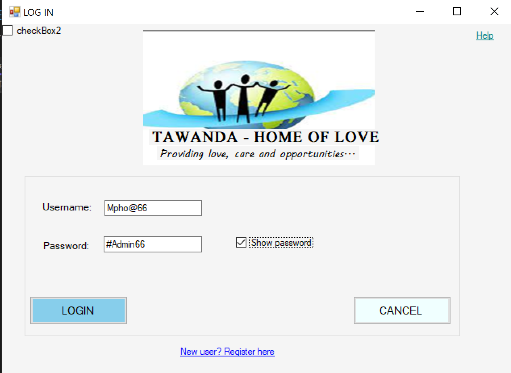
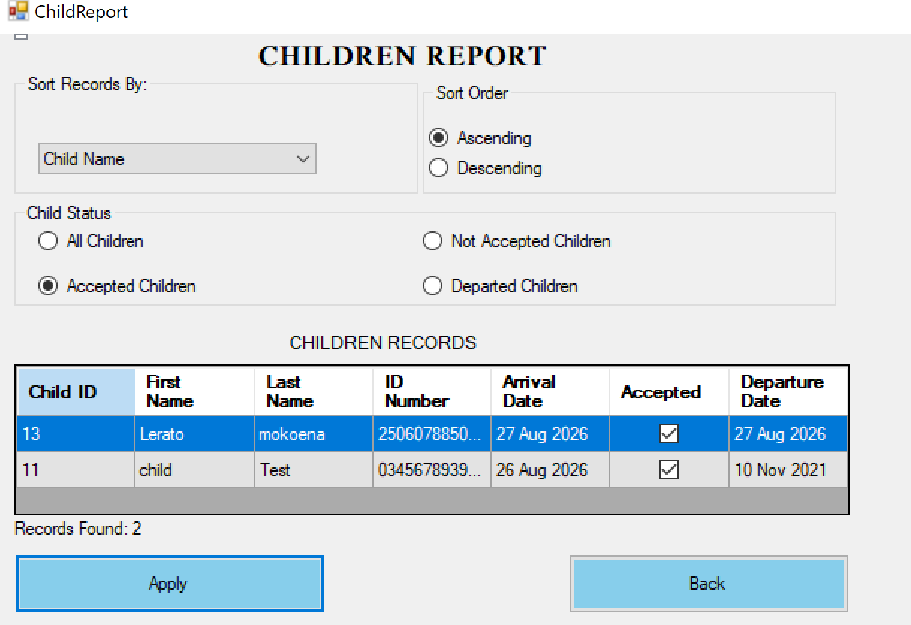
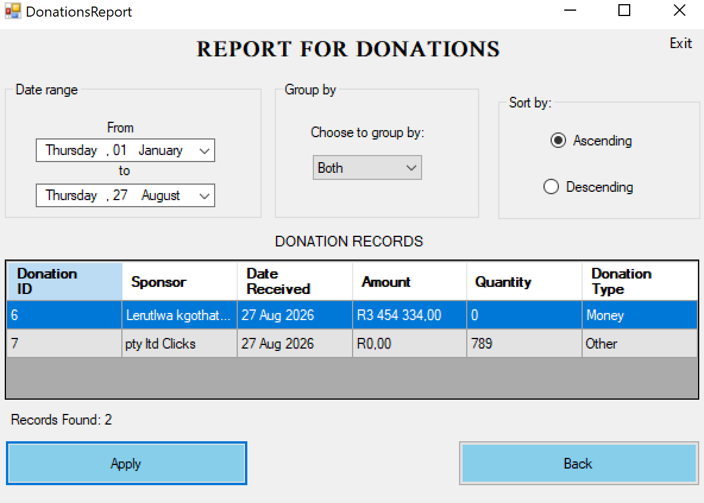

# Tawanda System

The **Tawanda System** is a desktop-based orphanage management system developed using **C# Windows Forms** and **Microsoft SQL Server**.

The system helps manage important orphanage records such as children, sponsors, donations, and users.

## Features

* **Child Management** – Add, update, search, and manage child records.
*  **Sponsor Management** – Store and update sponsor information.
*  **Donation Management** – Record and manage donations received from sponsors.
*  **Reports** – Generate child and donation reports.
*  **User Management** – Manage users and control access to the system.
*  **Database Integration** – Store system information using Microsoft SQL Server.

## Technologies

* C#
* Windows Forms
* .NET
* Microsoft SQL Server
* SQL
* Visual Studio
* Git & GitHub

## Database

The system uses a **TAWANDA** SQL Server database to store:

* Child records
* Sponsor records
* Donation records
* User information

The database script is included in the repository as:

`Tawanda_Database.sql`

## Running the Project

1. Clone the repository.
2. Open `TawandaSystem.sln` in Visual Studio.
3. Set up the **TAWANDA** database using the included SQL script.
4. Check the database connection settings.
5. Build and run the application.

## Project Background

This project was originally developed as a **CMPG223 Group 19** project. The updated version involved improving the existing system, fixing database and application issues, and improving the child, sponsor, donation, user management, and reporting functionality.

## Repository

[Updated Tawanda System](https://github.com/CMPG223-GROUP19/Updated-Sytem)

## 📸 Screenshots

### Login

### Child Management

### Adding Donations

### Updating Records

### Child Report

### Donation Report

### User Management

### Access Control
